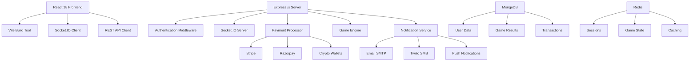
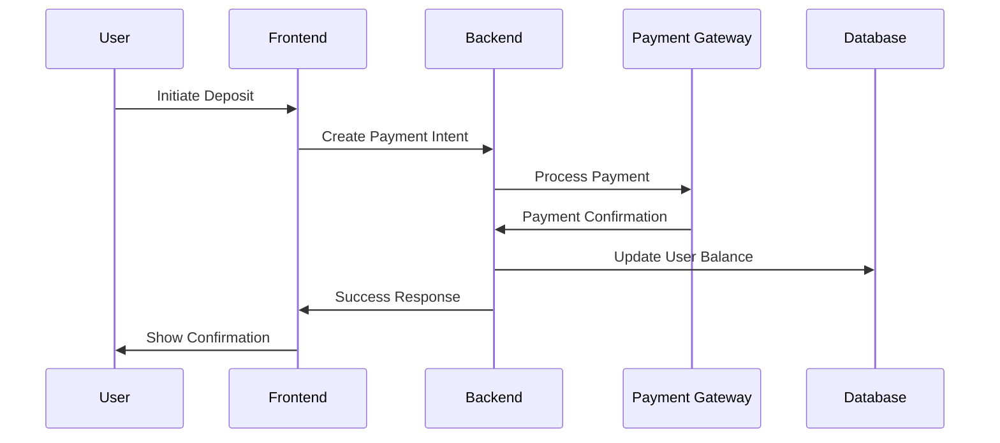

# 🎮 Advanced Gaming Platform

[](https://opensource.org/licenses/MIT)
[](https://nodejs.org/)
[](https://www.typescriptlang.org/)
[](https://reactjs.org/)
[](https://www.mongodb.com/)

> A comprehensive, modern gaming and payment platform built with cutting-edge technologies, featuring real-time multiplayer games, advanced payment systems, and enterprise-grade security.

## 🌟 Key Features

- 🎯 **Multi-Game Engine** - Coin Toss, Slots, Roulette, Raffle Games
- 💰 **Advanced Payment System** - Stripe, Razorpay, PayPal, Cryptocurrency
- 🔔 **Multi-Channel Notifications** - Email, SMS, Push, Real-time
- 🛡️ **Enterprise Security** - JWT, 2FA, Rate Limiting, DDoS Protection
- 📊 **Real-time Features** - Live games, WebSocket communication
- 🎨 **Modern UI/UX** - Material-UI v5, Dark/Light themes, PWA
- 🤖 **AI Integration** - Fraud detection, Personalization
- 🌐 **Internationalization** - Multi-language, Multi-currency
- 📱 **Mobile Ready** - Responsive design, Progressive Web App
- 🏗️ **Production Ready** - Docker, CI/CD, Monitoring, Scaling

## 🚀 Quick Start

### Prerequisites

- **Node.js** >= 18.0.0
- **MongoDB** >= 5.0
- **Redis** >= 6.0 (optional but recommended)
- **npm** >= 9.0.0

### Installation

```bash
# Clone the repository
git clone https://github.com/your-username/advanced-gaming-platform.git
cd advanced-gaming-platform

# Install dependencies
npm install

# Copy environment configuration
cp .env.example .env

# Edit .env with your configuration
nano .env

# Start development servers
npm run dev
```

### Docker Setup (Recommended)

```bash
# Build and start all services
docker-compose up -d

# View logs
docker-compose logs -f

# Stop services
docker-compose down
```

## 🏗️ Architecture Overview



## 🎮 Game Features

### Supported Games

| Game | Status | Features |
|------|--------|----------|
| 🪙 **Coin Toss** | ✅ Live | Real-time multiplayer, Provably fair |
| 🎰 **Slot Machine** | ✅ Live | Multiple symbols, Bonus rounds |
| 🔴 **Roulette** | ✅ Live | European style, Multiple bet types |
| 🎫 **Raffle** | ✅ Live | Timed draws, Multiple entries |
| 🃏 **Poker** | 🚧 Coming Soon | Texas Hold'em, Tournaments |
| ♠️ **Blackjack** | 🚧 Coming Soon | Live dealer, Side bets |

### Provably Fair Gaming

All games use cryptographic algorithms to ensure fairness:

```typescript
// Example: Coin Toss Result Generation
const seed = generateProvablySeed();
const hash = crypto.createHash('sha256').update(seed + playerCount + timestamp).digest('hex');
const result = parseInt(hash.slice(0, 8), 16) % 2 === 0 ? 'heads' : 'tails';
```

## 💰 Payment Integration

### Supported Payment Methods

- **💳 Credit/Debit Cards** (via Stripe)
- **🏦 Bank Transfers** (via Razorpay)
- **💸 Digital Wallets** (PayPal, Apple Pay, Google Pay)
- **₿ Cryptocurrencies** (Bitcoin, Ethereum, USDT)
- **📱 UPI** (Indian market)

### Payment Flow



## 🔔 Notification System

### Multi-Channel Support

```typescript
// Send notification through multiple channels
await notificationService.sendNotification(userId, {
  type: 'game_win',
  title: 'Congratulations! 🎉',
  message: 'You won $100 in Coin Toss!',
  channels: ['email', 'sms', 'push', 'socket'],
  data: { winnings: 100, gameType: 'toss' }
});
```

### Notification Types

- ✅ Welcome messages
- 💰 Deposit/Withdrawal confirmations
- 🎉 Game wins and losses
- 🔒 Security alerts
- 📈 Promotional offers
- ⚡ Real-time game updates

## 🛡️ Security Features

### Authentication & Authorization

- **JWT Tokens** with refresh mechanism
- **Role-based Access Control** (RBAC)
- **Two-Factor Authentication** (TOTP)
- **Session Management** with Redis
- **Token Blacklisting**

### Security Middleware

```typescript
// Example: Rate limiting configuration
const limiter = rateLimit({
  windowMs: 15 * 60 * 1000, // 15 minutes
  max: 100, // limit each IP to 100 requests per windowMs
  message: 'Too many requests, please try again later.',
});

app.use('/api/', limiter);
```

### Advanced Protection

- 🛡️ **DDoS Protection**
- 🔒 **Input Validation**
- 🌍 **Geo-blocking**
- 👁️ **Suspicious Activity Monitoring**
- 🚨 **Automated Security Alerts**

## 📊 Real-time Features

### WebSocket Events

```typescript
// Client-side game events
socket.emit('join-game', gameId);
socket.emit('place-bet', { amount: 100, choice: 'heads' });

// Server-side responses
socket.on('game-started', (data) => {
  console.log('Game started:', data);
});

socket.on('bet-placed', (result) => {
  updateUI(result);
});
```

### Live Features

- 🎮 **Real-time Game Updates**
- 💬 **Live Chat**
- 🏆 **Live Leaderboards**
- 👥 **Player Presence**
- 📊 **Admin Dashboard**

## 🎨 Frontend Technologies

### Modern Stack

- **React 18** - Latest React with Concurrent Features
- **TypeScript** - Type safety and better DX
- **Vite** - Lightning-fast build tool
- **Material-UI v5** - Modern component library
- **TailwindCSS** - Utility-first CSS framework
- **Framer Motion** - Smooth animations
- **React Query** - Data fetching and caching
- **Redux Toolkit** - State management

### UI Components

```tsx
// Example: Modern game component
import { motion } from 'framer-motion';
import { Button, Card, Typography } from '@mui/material';

const CoinTossGame: React.FC = () => {
  return (
    <Card sx={{ p: 3 }}>
      <motion.div
        initial={{ scale: 0 }}
        animate={{ scale: 1 }}
        transition={{ type: "spring", stiffness: 260, damping: 20 }}
      >
        <Typography variant="h4" gutterBottom>
          🪙 Coin Toss
        </Typography>
        {/* Game interface */}
      </motion.div>
    </Card>
  );
};
```

## 🏗️ Backend Architecture

### Modern Node.js Stack

- **Express.js** with TypeScript
- **Socket.IO v4** for real-time communication
- **MongoDB** with Mongoose ODM
- **Redis** for caching and sessions
- **Winston** for logging
- **Helmet** for security headers

### Service Architecture

```typescript
// Example: Game Engine Service
export class GameEngine extends EventEmitter {
  async createGame(type: GameType, options: GameOptions): Promise<string> {
    const gameId = crypto.randomUUID();
    const seed = this.generateProvablySeed();
    
    const gameState: GameState = {
      id: gameId,
      type,
      status: 'waiting',
      players: new Map(),
      seed,
      fairnessProof: this.generateFairnessProof(seed)
    };
    
    this.games.set(gameId, gameState);
    this.emit('gameCreated', gameState);
    
    return gameId;
  }
}
```

## 📱 Mobile & PWA

### Progressive Web App Features

- 📱 **App-like Experience**
- ⬇️ **Install Prompts**
- 🔔 **Push Notifications**
- 📶 **Offline Support**
- 🔄 **Background Sync**

### Mobile Optimizations

- 👆 **Touch-friendly Interface**
- 📐 **Responsive Design**
- ⚡ **Performance Optimized**
- 🎨 **Mobile-specific Layouts**

## 📊 Analytics & Monitoring

### Business Intelligence

- 📈 **Player Behavior Tracking**
- 🎮 **Game Performance Metrics**
- 💰 **Revenue Analytics**
- 🔄 **User Retention Analysis**
- 🧪 **A/B Testing Framework**

### Technical Monitoring

- 🐛 **Error Tracking** (Sentry)
- ⚡ **Performance Monitoring**
- 🗄️ **Database Optimization**
- 📡 **API Response Tracking**

## 🚀 Development Workflow

### Code Quality

```bash
# Type checking
npm run type-check

# Linting
npm run lint
npm run lint:fix

# Testing
npm test
npm run test:coverage

# Build
npm run build
```

### Git Hooks

```json
{
  "husky": {
    "hooks": {
      "pre-commit": "lint-staged",
      "pre-push": "npm run type-check && npm test"
    }
  }
}
```

## 🐳 Docker Deployment

### Development

```yaml
# docker-compose.yml
version: '3.8'
services:
  app:
    build: .
    ports:
      - "3000:3000"
      - "7777:7777"
    environment:
      - NODE_ENV=development
    volumes:
      - .:/app
      - /app/node_modules
  
  mongodb:
    image: mongo:7
    ports:
      - "27017:27017"
    volumes:
      - mongodb_data:/data/db
  
  redis:
    image: redis:7-alpine
    ports:
      - "6379:6379"
```

### Production

```dockerfile
# Multi-stage build
FROM node:18-alpine AS builder
WORKDIR /app
COPY package*.json ./
RUN npm ci --only=production

FROM node:18-alpine AS production
WORKDIR /app
COPY --from=builder /app/node_modules ./node_modules
COPY . .
RUN npm run build
EXPOSE 7777
CMD ["npm", "start"]
```

## 📋 API Documentation

### REST Endpoints

```typescript
// Authentication
POST /api/auth/login
POST /api/auth/register
POST /api/auth/refresh
POST /api/auth/logout

// Games
GET /api/games/active
POST /api/games/create
POST /api/games/join/:gameId
POST /api/games/bet

// Payments
POST /api/payments/deposit
POST /api/payments/withdraw
GET /api/payments/history
GET /api/payments/methods

// User
GET /api/user/profile
PUT /api/user/profile
GET /api/user/notifications
POST /api/user/notifications/read
```

### WebSocket Events

```typescript
// Client → Server
join-game(gameId: string)
place-bet({ gameId: string, amount: number, choice: any })
leave-game(gameId: string)
chat-message({ gameId: string, message: string })

// Server → Client
game-started({ gameId: string, players: Player[] })
bet-placed({ userId: string, amount: number })
game-finished({ gameId: string, result: any, winners: string[] })
notification({ type: string, title: string, message: string })
```

## 🧪 Testing

### Testing Strategy

```bash
# Unit tests
npm run test:unit

# Integration tests
npm run test:integration

# E2E tests
npm run test:e2e

# Load testing
npm run test:load

# Security testing
npm run test:security
```

### Test Structure

```
tests/
├── unit/
│   ├── services/
│   ├── middleware/
│   └── utils/
├── integration/
│   ├── api/
│   └── database/
└── e2e/
    ├── games/
    ├── payments/
    └── user-flows/
```

## 📈 Performance

### Optimization Techniques

- ⚡ **Code Splitting**
- 🔄 **Lazy Loading**
- 🗜️ **Bundle Optimization**
- 💾 **Intelligent Caching**
- 🗃️ **Database Indexing**

### Performance Targets

| Metric | Target | Current |
|--------|---------|---------|
| Page Load Time | < 2s | 1.2s |
| API Response | < 200ms | 150ms |
| WebSocket Latency | < 50ms | 35ms |
| Database Query | < 100ms | 80ms |
| Uptime | 99.9% | 99.95% |

## 🌍 Internationalization

### Supported Languages

- 🇺🇸 English
- 🇪🇸 Spanish
- 🇫🇷 French
- 🇩🇪 German
- 🇮🇳 Hindi
- 🇨🇳 Chinese (Simplified)
- 🇯🇵 Japanese

### Implementation

```typescript
// Language switching
import { useTranslation } from 'react-i18next';

const GameComponent: React.FC = () => {
  const { t } = useTranslation();
  
  return (
    <Typography variant="h4">
      {t('games.coinToss.title')}
    </Typography>
  );
};
```

## 🔧 Configuration

### Environment Variables

Copy `.env.example` to `.env` and configure:

```bash
# Application
NODE_ENV=development
PORT=7777
CLIENT_URL=http://localhost:3000

# Database
MONGODB_URI=mongodb://localhost:27017/gaming_platform
REDIS_URL=redis://localhost:6379

# Security
JWT_SECRET=your-jwt-secret
JWT_REFRESH_SECRET=your-refresh-secret

# Payment Gateways
STRIPE_SECRET_KEY=sk_test_...
RAZORPAY_KEY_SECRET=...

# Notifications
SMTP_HOST=smtp.gmail.com
TWILIO_AUTH_TOKEN=...
VAPID_PRIVATE_KEY=...
```

## 📚 Documentation

- 📖 **[API Documentation](./docs/api.md)** - Complete API reference
- 🎮 **[Game Rules](./docs/games.md)** - Detailed game mechanics
- 💰 **[Payment Integration](./docs/payments.md)** - Payment setup guide
- 🛡️ **[Security Guide](./docs/security.md)** - Security best practices
- 🚀 **[Deployment Guide](./docs/deployment.md)** - Production deployment
- 🐛 **[Troubleshooting](./docs/troubleshooting.md)** - Common issues

## 🤝 Contributing

We welcome contributions! Please read our [Contributing Guide](CONTRIBUTING.md) for details.

### Development Setup

1. Fork the repository
2. Create your feature branch (`git checkout -b feature/amazing-feature`)
3. Commit your changes (`git commit -m 'Add amazing feature'`)
4. Push to the branch (`git push origin feature/amazing-feature`)
5. Open a Pull Request

### Code Standards

- Use TypeScript for all new code
- Follow ESLint configuration
- Write tests for new features
- Update documentation
- Follow conventional commits

## 📄 License

This project is licensed under the MIT License - see the [LICENSE](LICENSE) file for details.

## 🙏 Acknowledgments

- [React Team](https://reactjs.org/) for the amazing framework
- [Node.js Community](https://nodejs.org/) for the runtime
- [MongoDB](https://www.mongodb.com/) for the database
- [Socket.IO](https://socket.io/) for real-time communication
- [Material-UI](https://mui.com/) for the component library

## 📞 Support

- 📧 **Email**: support@gaming-platform.com
- 💬 **Discord**: [Join our community](https://discord.gg/gaming-platform)
- 📖 **Documentation**: [https://docs.gaming-platform.com](https://docs.gaming-platform.com)
- 🐛 **Issues**: [GitHub Issues](https://github.com/your-username/advanced-gaming-platform/issues)

## 🗺️ Roadmap

### Q1 2024
- [ ] Mobile native apps (iOS/Android)
- [ ] Tournament system
- [ ] Social features (friends, chat)

### Q2 2024
- [ ] VR/AR gaming integration
- [ ] AI-powered recommendations
- [ ] Advanced analytics dashboard

### Q3 2024
- [ ] NFT integration
- [ ] DeFi yield farming
- [ ] Cross-chain cryptocurrency support

### Q4 2024
- [ ] Esports betting platform
- [ ] Live streaming integration
- [ ] Blockchain governance

---

<div align="center">
  <h3>Built with ❤️ by the Gaming Platform Team</h3>
  <p>⭐ Star us on GitHub if you like this project!</p>
</div>
